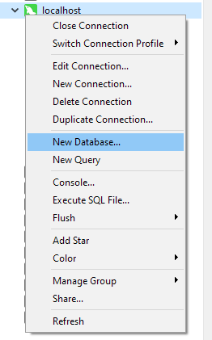
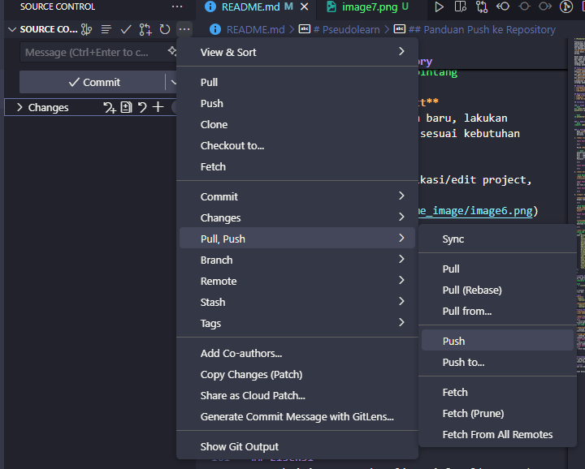
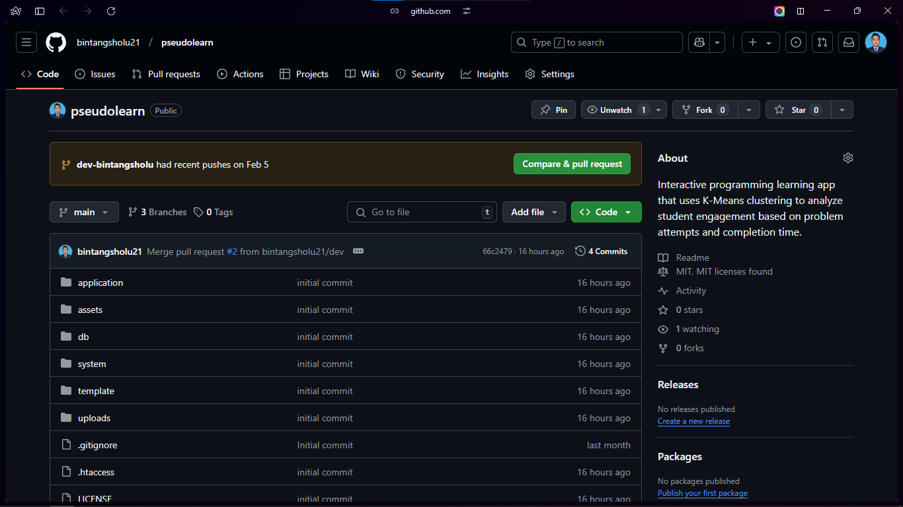

# *Pseudolearn*
---
Pseudolearn adalah aplikasi pembelajaran dasar pemrograman berbasis pseudocode yang dirancang untuk membantu siswa memahami konsep dasar pemrograman dengan cara yang interaktif. Aplikasi ini memungkinkan siswa untuk belajar dengan cara **drag and drop**, menyusun kode pseudocode secara benar, serta melacak progres belajar mereka.

Dosen dapat memantau aktivitas mahasiswa melalui data yang dikumpulkan seperti jumlah percobaan dan waktu yang digunakan untuk menyelesaikan soal. Dengan informasi ini, dosen dapat menganalisis pola belajar mahasiswa dan merancang strategi pembelajaran yang lebih efisien.

## Fitur Utama
- **Pembelajaran Interaktif**: Siswa dapat menyusun kode pseudocode secara visual.
- **Pelacakan Progres**: Data jumlah percobaan dan waktu pengerjaan soal direkam untuk analisis.
- **Manajemen Nilai**: Dosen dapat melihat nilai dan aktivitas mahasiswa.
- **Analisis Pembelajaran**: Data yang dikumpulkan dapat digunakan untuk menyusun strategi pembelajaran yang lebih baik.

## Teknologi yang Digunakan
- **Framework**: CodeIgniter 3
- **UI Framework**: Bootstrap 3
- **Database**: MySQL

## Requirement
- **PHP 7.4**
- **MySQL**
- **Web Server** (XAMPP, Laragon, MAMP, dsb.)

## Instalasi dan Penggunaan di Lokal

### 1. Clone Repository
```bash
git clone https://github.com/bintangsholu21/pseudolearn.git
```

```bash
cd pseudolearn
```

### 2. Update Composer
```bash
composer update
```

### 3. Konfigurasi Database
   Buka **XAMPP Control Panel** atau **Laragon** pastikan **Apache** dan **MySQL** sudah berjalan. 

1. **Buat Connection Baru**

   

   Pilih **MySQL** lalu isi form seperti ini

   ``` bash
   Connection Name : localhost
   Host : localhost
   Port : 3306
   User : root
   Password :
   ```

   

2. **Buat Database Baru**

   `Klik Kanan` pada **localhost** lalu pilih **Open Connection** lalu `Klik Kanan` pada **localhost** lagi lalu pilih **New Database**

   
   <br>
   Isi form seperti ini

   


3. **Import Database**

   **Download File SQL Database** di folder `db` dengan nama `db_pseudolearnapp_2025.sql`
   `Klik Kanan` pada **pseudolearnapp** lalu pilih **Open Database** lalu `Klik Kanan` pada **pseudolearnapp** lalu pilih **Execute SQL File**

   

   **lanjutkan dengan memilih file** `db_pseudolearnapp_2025.sql` yang sudah di download tadi lalu **Klik Start**

4. **Atur koneksi database di `application/config/database.php`**:
   ```php
   $db['default'] = array(
       'dsn'   => '',
       'hostname' => 'localhost',
       'username' => 'root',
       'password' => '',
       'database' => 'pseudolearnapp',
       'dbdriver' => 'mysqli',
       'dbprefix' => '',
       'pconnect' => FALSE,
       'db_debug' => (ENVIRONMENT !== 'production'),
       'cache_on' => FALSE,
       'cachedir' => '',
       'char_set' => 'utf8',
       'dbcollat' => 'utf8_general_ci',
       'swap_pre' => '',
       'encrypt' => FALSE,
       'compress' => FALSE,
       'stricton' => FALSE,
       'failover' => array(),
       'save_queries' => TRUE
   );
   ```
<br>

## Jalankan Aplikasi
Pastikan server lokal sudah berjalan (XAMPP/LAMP/MAMP), lalu command terminal di dalam folder `pseudolearn`:

```bash
php -S localhost:8000
```

Buka browser dan ketikkan `localhost:8000` pada address bar.

## Memberhentikan Aplikasi
Untuk memberhentikan aplikasi, tekan `Ctrl + C` pada terminal.

## Login
- **Dosen**
  - *email*: dosen@dosen.com
   - *password*: password

- **Mahasiswa**
   - *email*: {NIM}@gmail.com
   - *password*: {NIM}

## Panduan Push ke Repository
   **Pastikan Sebelum Modifikasi/Edit Project sudah membuat Branch Baru**

1. **Buat Branch Baru dari Dev (Hanya Pertama Kali)**
   
   <br>
   - Pilih dari **origin/dev** lalu masukkan nama branch baru yang akan dibuat dengan prefix `dev-nama` contoh `dev-bintang`

2. **Pull dari Origin Dev**
   - Setelah membuat branch baru, lakukan git pull dari origin dev
   ```bash
   git pull origin dev
   ```

3. **Modifikasi/Edit Project**
   - Setelah membuat branch baru, lakukan modifikasi/edit project sesuai kebutuhan

4. **Stage dan Commit**
   - Setelah selesai modifikasi/edit project, lakukan stage 
   
   

   - Pilih file yang akan di commit lalu masukkan pesan commit
   
   

   - Klik Commit
   
5. **Push ke Repository**
   - Setelah melakukan commit, lakukan push ke repository
   

6. **Buat Pull Request**
   - Klik `Compare & pull request` untuk membuat pull request
   

   - Ganti base branch ke `dev` dan compare branch ke branch yang sudah dibuat lalu klik `Create pull request`

   

## Kontribusi
Jika ingin berkontribusi, silakan fork repository ini dan buat pull request ke branch `dev` dengan perubahan yang diusulkan.

## Lisensi
Proyek ini menggunakan lisensi [MIT](LICENSE).

---
Selamat belajar dengan Pseudolearn! 🚀
